# QR Generator

A small CLI tool to generate designer-friendly QR codes as SVG. It focuses on flexible styling so your designer friend can pick a variant and tweak colors without touching the QR logic.

## Variant Gallery (example outputs)
Each QR below encodes `https://example.com` using the default settings for that variant.

<table>
  <tr>
    <td align="center"><strong>classic</strong><br/>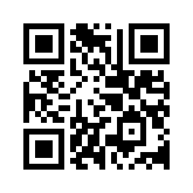</td>
    <td align="center"><strong>square</strong><br/></td>
    <td align="center"><strong>rounded</strong><br/>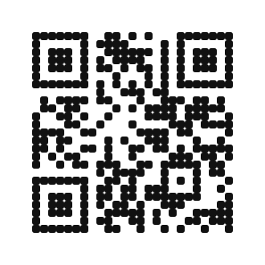</td>
  </tr>
  <tr>
    <td align="center"><strong>dot</strong><br/>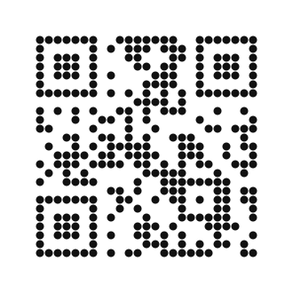</td>
    <td align="center"><strong>clear</strong><br/></td>
    <td align="center"><strong>clear-rounded</strong><br/>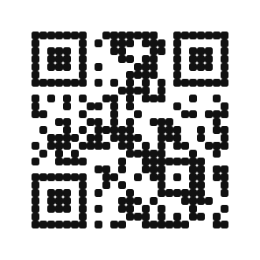</td>
  </tr>
  <tr>
    <td align="center"><strong>clear-dot</strong><br/></td>
    <td align="center"><strong>inverted</strong><br/>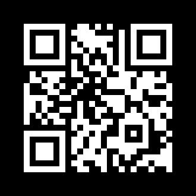</td>
    <td align="center"><strong>midnight</strong><br/></td>
  </tr>
  <tr>
    <td align="center"><strong>sunset</strong><br/>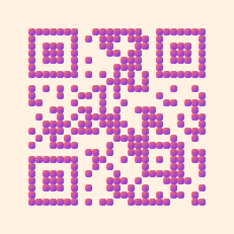</td>
    <td align="center"><strong>neon</strong><br/>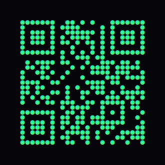</td>
    <td align="center"></td>
  </tr>
</table>

Animation variants (classic QR shown):
- `wave`: eases into/out of motion and holds still before/after
- `wave-loop`: always animated and perfectly looped
- `float`: gentle bob with a tilt applied after the motion
- `float-tilt-first`: tilt is applied first, then a vertical cloth-like drift
- `float-tilt-still`: tilted positions with axis-aligned squares (stylized drift)
- `float-jagged`: snapped bobbing motion with a retro, stepped feel

<table>
  <tr>
    <td align="center"><strong>wave</strong><br/>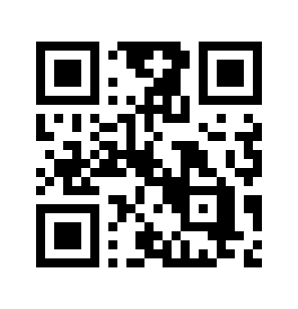</td>
    <td align="center"><strong>wave-loop</strong><br/>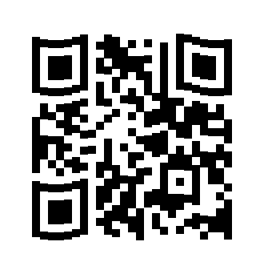</td>
  </tr>
  <tr>
    <td align="center"><strong>float</strong><br/>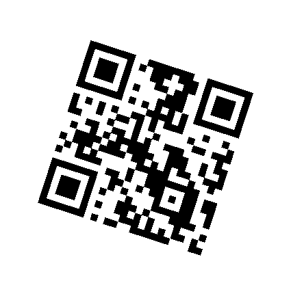</td>
    <td align="center"><strong>float-tilt-first</strong><br/></td>
    <td align="center"><strong>float-tilt-still</strong><br/>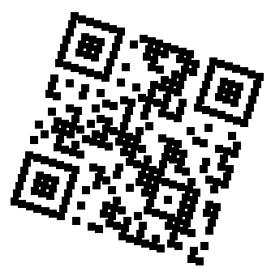</td>
  </tr>
  <tr>
    <td align="center"><strong>float-jagged</strong><br/></td>
    <td align="center"></td>
  </tr>
</table>

## Why
- Fast CLI workflow plus an optional GUI for exploration.
- A handful of standard styles plus playful, colorful variants.
- SVG output for easy editing in design tools.

## Go setup
Requirements:
- Go 1.20+ (module uses `go 1.20`)

## Go CLI
Quick start:
```bash
go run ./cmd/qr_generator --list-variants
```

Note: the positional data argument must come last (after flags), or the Go flag parser will stop early.

Generate an SVG (same defaults as the Python CLI):
```bash
go run ./cmd/qr_generator -o out/qr.svg "https://example.com"
```

Generate a PNG (native renderer):
```bash
go run ./cmd/qr_generator --png -o out/qr.svg "https://example.com"
```

Generate a PNG catalog:
```bash
go run ./cmd/qr_generator --catalog --png -o out/catalog.svg "https://example.com"
```

Export PDF/PS (native Go output):
```bash
go run ./cmd/qr_generator --pdf -o out/qr.svg "https://example.com"
go run ./cmd/qr_generator --ps -o out/qr.svg "https://example.com"
```

Animated GIF (native Go renderer):
```bash
go run ./cmd/qr_generator --gif -o out/qr.svg "Wave me"
go run ./cmd/qr_generator --animation --animation-variant wave "Wave me"
go run ./cmd/qr_generator --animation --animation-variant wave-loop "Always waving"
go run ./cmd/qr_generator --animation --animation-variant float "Smooth float"
go run ./cmd/qr_generator --animation --animation-variant float-tilt-first "Vertical float"
go run ./cmd/qr_generator --animation --animation-variant float-tilt-still "Tilted positions (still squares)"
go run ./cmd/qr_generator --animation --animation-variant float-jagged "Retro float"
```

Build a local binary:
```bash
go build -o bin/qr_generator ./cmd/qr_generator
./bin/qr_generator --list-variants
```

Run Go tests:
```bash
go test ./...
```

Optional PNG tolerance test (requires `python3` + `cairosvg`):
```bash
PNG_SIM_THRESHOLD=0.98 go test ./internal/renderpng -run SvgToPngTolerance
```

## Go GUI (Wails, experimental)
The GUI is a thin wrapper around the Go renderer and uses the same `variants.json` config.

Requirements:
- Go 1.20+
- Node.js 18+
- Wails CLI v2.10+

Install Wails:
```bash
go install github.com/wailsapp/wails/v2/cmd/wails@v2.10.0
```

Run the GUI in dev mode:
```bash
cd gui
wails dev
```

Build a local GUI binary:
```bash
cd gui
wails build
```

Artifacts land in `gui/build/bin/` (for example `qr-generator`, `qr-generator.exe`, or `qr-generator.app`).

## Legacy Python implementation
The original Python CLI + GUI live in the `legacy/python` submodule.
See `legacy/python/README.md` for setup and usage.

## Variants
Variants (and animation defaults) are defined in `variants.json` to keep styling config shareable across future tooling.

Standard:
- `classic` (also `square`): black modules on white background
- `rounded`: softened corners
- `dot`: circular modules
- `clear`: black modules on transparent background
- `clear-rounded`: rounded modules on transparent background
- `clear-dot`: dot modules on transparent background

More playful:
- `inverted`: white on black
- `midnight`: pale modules on a deep blue background
- `sunset`: rounded modules with a warm gradient
- `neon`: dot modules with a high-contrast gradient


List all variants:
```bash
go run ./cmd/qr_generator --list-variants
```

## PNG Export
Add `--png` to write a PNG alongside the SVG:
```bash
go run ./cmd/qr_generator --png -o out/qr.svg "https://example.com"
```

Increase raster resolution with `--png-scale` (multiplies the SVG pixel size):
```bash
go run ./cmd/qr_generator --png --png-scale 4 -o out/qr.svg "https://example.com"
```

You can also choose the PNG path:
```bash
go run ./cmd/qr_generator --png --png-output out/preview.png -o out/qr.svg "https://example.com"
```

## PDF/PS Export
Export vector formats that Photoshop can open:
```bash
go run ./cmd/qr_generator --pdf -o out/qr.svg "https://example.com"
go run ./cmd/qr_generator --ps -o out/qr.svg "https://example.com"
```

## Animation (GIF)
Create an animated GIF based on the chosen variant:
```bash
go run ./cmd/qr_generator --gif -o out/qr.svg "https://example.com"
go run ./cmd/qr_generator --animation --animation-variant wave -o out/qr.svg "https://example.com"
go run ./cmd/qr_generator --animation --animation-variant wave-loop -o out/qr.svg "https://example.com"
go run ./cmd/qr_generator --animation --animation-variant float -o out/qr.svg "https://example.com"
go run ./cmd/qr_generator --animation --animation-variant float-tilt-first -o out/qr.svg "https://example.com"
go run ./cmd/qr_generator --animation --animation-variant float-tilt-still -o out/qr.svg "https://example.com"
go run ./cmd/qr_generator --animation --animation-variant float-jagged -o out/qr.svg "https://example.com"
go run ./cmd/qr_generator --gif --gif-fps 12 --gif-frames 40 --gif-hold 24 -o out/qr.svg "https://example.com"
go run ./cmd/qr_generator --gif --wave-amp 0.3 --wave-period 14 -o out/qr.svg "https://example.com"
go run ./cmd/qr_generator --animation --animation-variant float-tilt-first --float-angle 90 -o out/qr.svg "https://example.com"
go run ./cmd/qr_generator --gif --readable-gif -o out/qr.svg "https://example.com"
```

Notes:
- `wave` eases into/out of motion and holds still before/after the wave.
- `wave-loop` is always animated and perfectly looped.
- `float` adds a subtle tilt after the motion is applied.
- `float-tilt-first` tilts the QR first, then drifts vertically like cloth.
- `float-tilt-still` keeps modules axis-aligned while the QR drifts on a tilt.
- `float-jagged` uses snapped steps to mimic retro motion.
- `--readable-gif` uses scan-safer defaults; you can still override any animation options.
- `--gif` is an alias for `--animation --animation-format gif`.
- Animation output is not supported with `--catalog`.

## Catalog Grid
Generate a single labeled grid showing all variants:
```bash
go run ./cmd/qr_generator --catalog -o out/catalog.svg "https://example.com"
go run ./cmd/qr_generator --catalog --catalog-columns 4 --png -o out/catalog.svg "https://example.com"
```

## Common Options
- `--scale`: module size in pixels (default 10)
- `--border`: quiet zone in modules (default 4)
- `--error`: `l`, `m`, `q`, `h` (default `m`)
- `--dark`: override foreground color
- `--light`: override background color
- `--no-background`: transparent background
- `--radius`: rounded corner radius (0-0.5)
- `--gradient`: enable foreground gradient fill
- `--no-gradient`: disable foreground gradient
- `--gradient-from`: gradient start color
- `--gradient-to`: gradient end color
- `--gradient-angle`: gradient direction in degrees (0 = left to right)
- `--gradient-from-stop`: gradient start stop (0-1)
- `--gradient-to-stop`: gradient end stop (0-1)
- `--gradient-scope`: `module` (per module) or `global` (whole QR)
- `--bg-gradient`: enable background gradient
- `--no-bg-gradient`: disable background gradient
- `--bg-gradient-from`: background gradient start color
- `--bg-gradient-to`: background gradient end color
- `--bg-gradient-angle`: background gradient direction in degrees
- `--bg-gradient-from-stop`: background gradient start stop (0-1)
- `--bg-gradient-to-stop`: background gradient end stop (0-1)
- `--png-scale`: scale multiplier for PNG export
- `--animation`: render an animated output (default format: gif)
- `--animation-format`: animation format (currently `gif`)
- `--animation-variant`: animation style (`wave`, `wave-loop`, `float`, `float-tilt-first`, `float-tilt-still`, `float-jagged`)
- `--gif`: alias for `--animation --animation-format gif`
- `--gif-variant`: GIF animation variant (`wave`, `wave-loop`, `float`, `float-tilt-first`, `float-tilt-still`, `float-jagged`)
- `--gif-fps`: frames per second for GIF
- `--gif-frames`: number of animation frames
- `--gif-hold`: number of still frames before/after the motion
- `--wave-amp`: wave/bob amplitude (in modules)
- `--wave-period`: wave period (in columns; used by wave + float variants)
- `--float-angle`: float drift direction in degrees (90 = vertical)
- `--readable-gif`: scan-safer defaults for animation GIFs

## Notes
- Primary output is SVG; add `--png` for a bitmap preview.
- `--pdf` and `--ps` are available for Photoshop-friendly vector output.
- Default output goes into `out/` (auto-created).
- If you override `--dark`, gradient variants fall back to the flat color.
- Catalog output uses each variant's default styling.
- Keep contrast high for scan reliability.

## License
MIT
